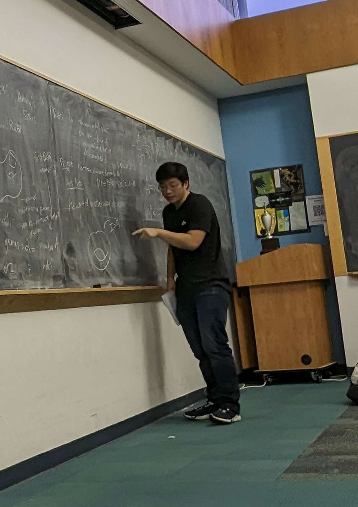

# Songyu Ye (叶松瑜）

Hello! I'm a third year undergraduate at Cornell University interested in algebraic geometry and algebraic topology. I'm currently studying moduli spaces of pointed curves using geometric invariant theory, advised by Professor Daniel Halpern-Leistner. I previously participated in the University of Maryland REU in Combinatorics, Algorithms, and Artificial Intelligence (2021).

You can find the REU paper [here](https://arxiv.org/abs/2304.02745)

