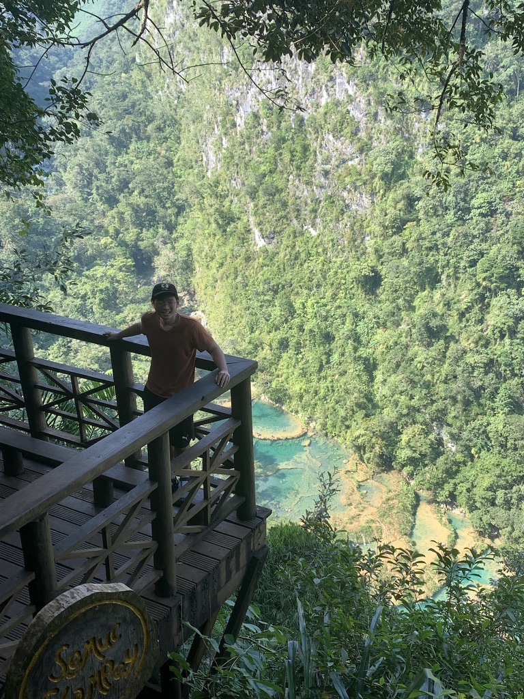

# Songyu Ye (叶松瑜）

Hello! I'm a third year undergraduate at Cornell University interested in algebraic geometry and topology. I currently think about toric geometry and the algebro-geometric and topological invariants of these spaces. I am mentored by Professors Allen Knutson (an algebraic geometer) and Tara Holm (a symplectic geometer), and these schools come together to put forth a rich story of the geometry of toric manifolds.

Recently I have developed a budding interest in the intersection of algebraic geometry, algebraic topology, and algebraic K theory. In particular, I am very curious about applications of derived algebraic geometry and motivic homotopy theory to problems in enumerative geometry (both of the algebraic and symplectic flavor).

Here is my [CV](./ye-cv.pdf).

I participated in the CAAR-REU at the University of Maryland in the Summer of 2022. During that time, I thought a lot about classical projective geometry. Coexeter has a wonderful book where he constructs a conic in the plane through 5 points using just a ruler. Note that 5 points determines the conic (there are six monomials of degree 2 in 3 variables, and 5 points would impose 5 linear equations on the coefficients and also scaling the coefficients gives the same conic). Nowadays people think about these problems with the modern techniques of enumerative geometry. You can find the REU paper [here](https://arxiv.org/abs/2304.02745).

I spent some time backpacking in Latin America in the winter of 2023. This is me at Semuc Champey, Guatemala.

