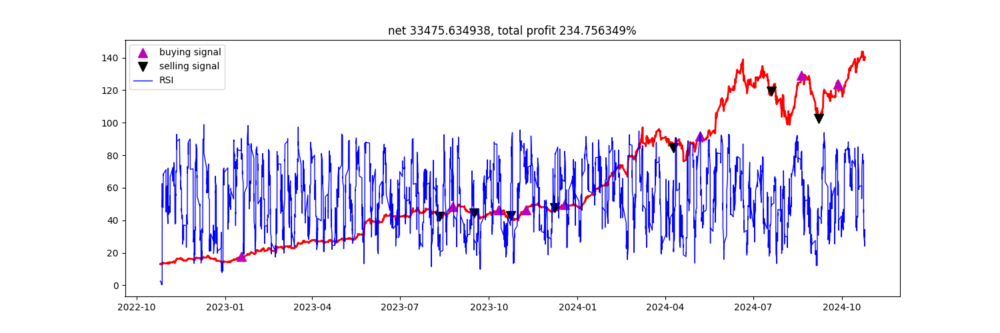
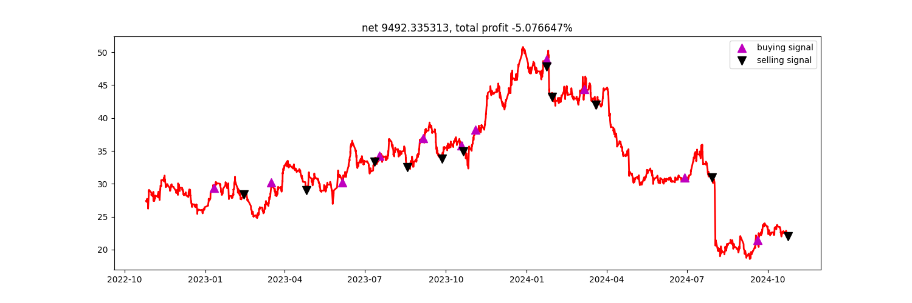
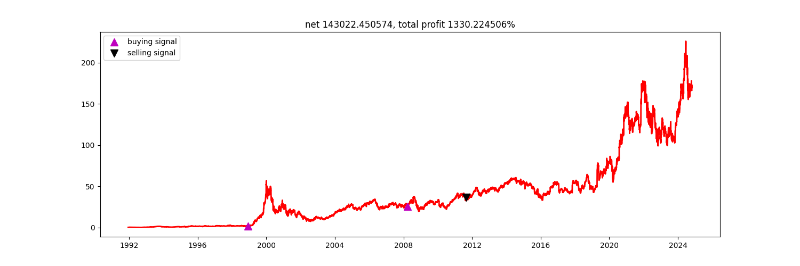

Every hour, I scan for technical signals and they end up here. Check out the buy/sell signals for Nvidia, Intel, and Qualcomm (updated in real time
using hourly data over the past two years)!

Some more [information](monitor/overview.txt) about the trades. 
Currently just paper trading but open to more.