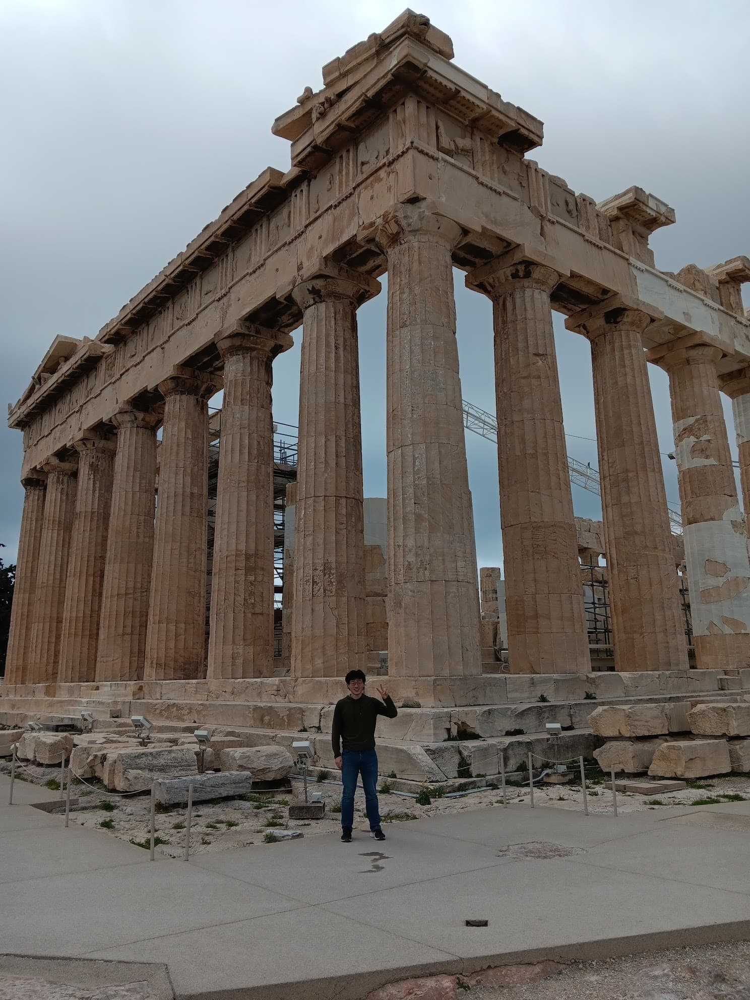
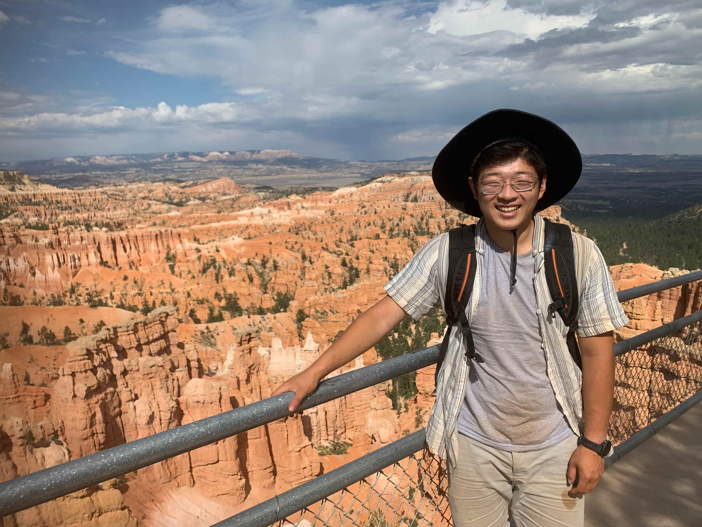
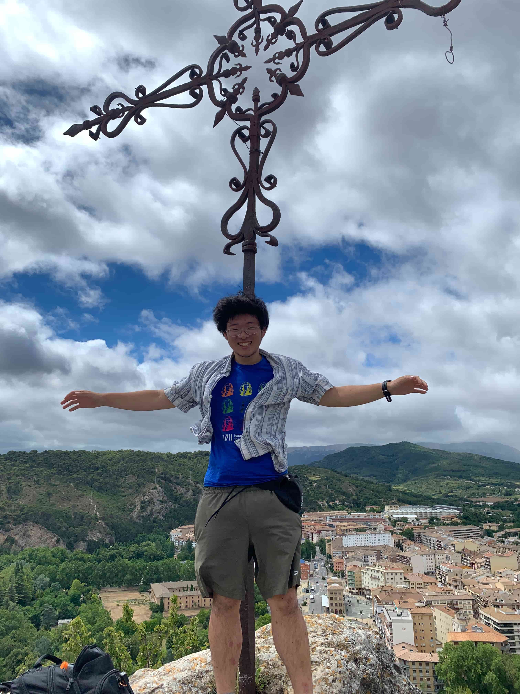
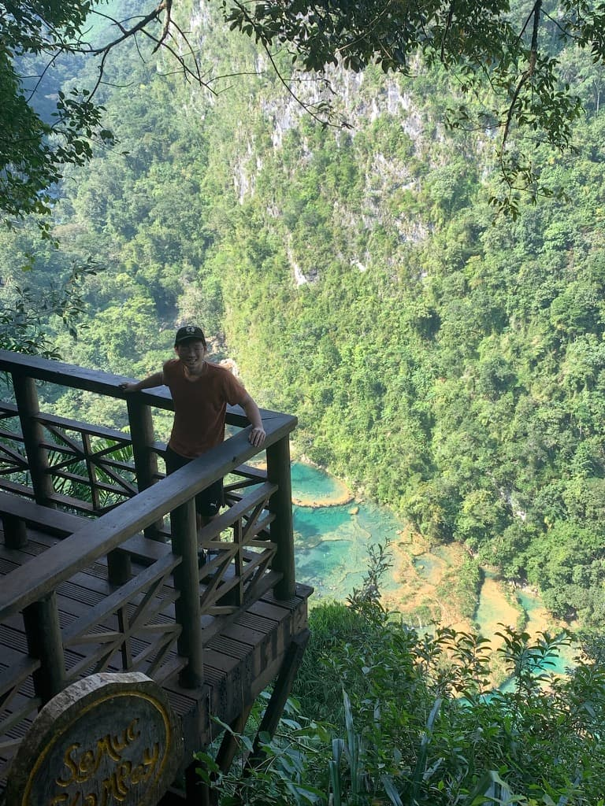

  <h1>Travel</h1>

<!-- Highlighted Countries Map -->

  <iframe src="highlighted_countries_map.html" width="100%" height="500px" style="max-width: 800px; border: none;"></iframe>

  <strong>Countries which I have visited</strong>

  

    
    

      <strong>The Parthenon</strong> 
      Athens, Greece 
      Winter 2025
    

  

  

    
    

      <strong>Sunset Point</strong> 
      Bryce Canyon, USA 
      Summer 2024
    

  

  

    
    

      <strong>The Mirador</strong> 
      Estella, Spain 
      Summer 2024
    

  

  

    
    

      <strong>Semuc Champey</strong> 
      Guatemala 
      Winter 2023
    

  

